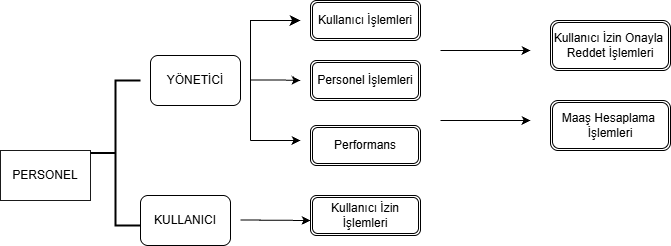

 # PERSONEL TAKİP UYGULAMASI
 Bu proje ,**C# Windows Forms** teknolojisi kullanılarak geliştirilmiş bir **Personel Takip Uygulamasıdır**. Nesne Yönelimli Programlama dersi kapsamında,eğitim amaçlı olarak hazırlanmıştır.

 ## PROJENİN AMACI
 Bu çalışmanın amacı;personel bilgilerinin bilgisayar ortamında düzenli, güvenli ve yönetilebilir bir şekilde saklanmasını sağlamak ve C# programlama dilinde **Nesne Yönelimli Programlama (OOP) prensiplerini**
 uygulamalı olarak pekiştirmektir.
 
 ## Kullanıcı Rolleri ve Yetkilendirme

### Yönetici Yetkileri
- Kullanıcı ekleme, silme ve yetkilendirme işlemleri  
- Tüm personel kayıtlarını görüntüleme  
- Personel ekleme, silme ve güncelleme işlemleri
- Personel izin onaylama reddetme işlemleri
- Maaş hesaplama işlemlerini gerçekleştirme  
- Personel performans puanlama işlemleri  
- Sistem genel ayarlarını yönetme  

### Kullanıcı Yetkileri
- Kendi profil bilgilerini görüntüleme  
- Personel izin listesini görüntüleme
- Kendisine atanmış izin ve yetkiler doğrultusunda işlem yapma
  
 ## UYGULAMA ÖZELLİKLERİ
 -Kullanıcı ve yönetici yetkilendirme sistemi
 -Personel ekleme işlemleri
 -Personel silme işlemleri
 -Personel güncelleme işlemleri
 -Personel listeleme işlemleri
 -Kullanıcı izin işlemleri
 -Performans puanlama sistemi
 -Maaş hesaplama sistemi
 -MySQL veritabanı entegrasyonu
 
 ## KULLANILAN TEKNOLOJİLER
 -C#(.NET Framework)
 -Windows Forms
 -MySQL
 -Visual Studio
 -Githup
 -Entity Layer:Katmanlı Mimari(DAL,BLL)
 
 ## PROJE YAPISI
 -'PersonelTakipFirstProject': Ana uygulama dosyaları
 -Formlar: Kulalnıcı arayüzü tasarımları
 -Veritabanı: MySQL bağlantı ve sorgu işlemleri
 -Yetkilendirme : Kullanıcı rol ve izin yönetimi
 ## KULLANILAN DİYAGRAMLAR
 
 ## Kullanım Senaryosu Diyagramı

## Class Diyagramı

 

 ## Sonuç
 Bu proje kapsamında, personel yönetimine yönelik temel işlemler gerçekleştirilmiştir; maaş hesaplama,performans puanlama ve kullanıcı yetkilendirme gibi fonksiyonlar başarıyla uygulanmıştır.
 Proje, veritabanı bağlantısı ve OOP yapısı açısından temel düzeyde işlevsel bir sistem sunmaktadır.

 ## Geliştirici 
 Meryem Gamze İbiş
 
 
